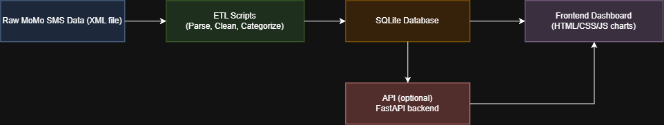

# MoMo SMS Analytics

## Team
- Didier Abizera (didier-abizera) — currently working solo. I missed Week 1 team formation due to a registration hold that has since been resolved. I am attending office hours to request placement into a team.

## Project Description
This project processes MoMo (Mobile Money) SMS transaction data provided in XML format. The system will:
- Parse and clean the raw XML data
- Categorize transactions (deposits, withdrawals, payments, transfers)
- Store the processed data in a relational database (SQLite)
- Provide a frontend dashboard to visualize and analyze the transaction data

## Architecture Diagram
 

## Scrum Board
(link to be added)
